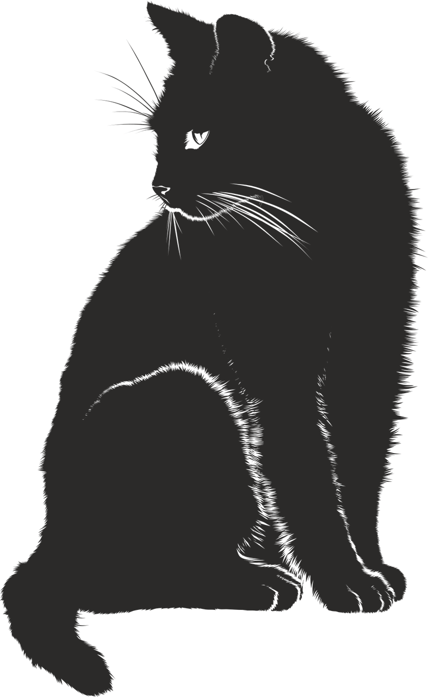

## Hello there, I'm Nicole 👋

### I'm a software engineering student and self-taught web developer.
Welcome to my Github profile! It's new, but I'm eager to become more active in open source.

- 📚 I’m working on my B.S. in Software Engineering (2024)
- 🖥️ My self-taught website and graphic design experience dates back to the early 2000s
- ⚙️ I'm working on Codecademy's Full-Stack Engineer career path
- 🖱️ I participate in #100Devs and #100DaysOfCode
- 🧰 I am always open to learning new languages and tools
- 💬 I enjoy collaboration and teamwork
- 🆕 My portfolio is new (April 2022), so stay tuned for my projects

### Languages and Tools:
These are the languages and tools I'm most familiar with. I have over 15 years of experience with website and graphic design tools. I took two Visual Basic programming classes in high school, and I started learning C++ in 2021 in my university coursework. I started learning JavaScript on my own in 2022, and my goal is to start becoming familiar with C#/.NET and Python this year.

#### Languages
         

#### Tools
                                  

### I'm always learning!
         

### Want to get in touch?
Please feel free to [email me](mailto:nicolecarman90@outlook.com) if you would like to network, collaborate, or discuss an opportunity with me!
You can also find me on social media.

      
